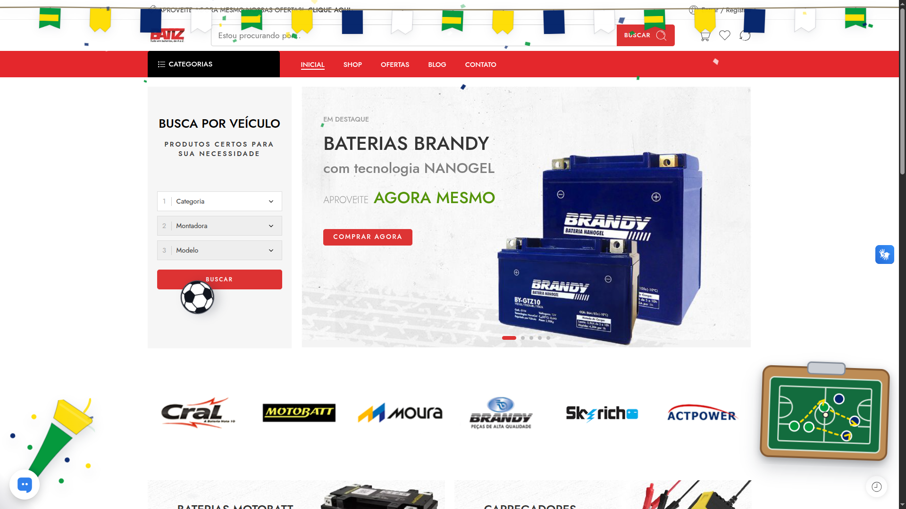

# World Cup Decorations

[Português do Brasil](#português-do-brasil)

A lightweight WordPress plugin that adds tasteful World Cup-themed decorations to your website, including animated bunting, confetti, a bouncing soccer ball, a vuvuzela intro, and a tactics board animation.

Designed especially for e-commerce websites that want a festive look without hurting usability, performance, or the shopping experience.

---

## Features

- Country-based color palettes
- Animated bunting with subtle wind movement
- Paper confetti with configurable intensity
- Intro-only bouncing soccer ball animation
- Intro-only vuvuzela animation
- Intro-only tactics board animation
- Preview modal inside the WordPress admin panel
- Mobile-friendly layout
- Separate desktop and mobile bunting coverage settings
- Option to disable decorations on mobile devices
- Option to hide decorations on sensitive WooCommerce pages
- Respects `prefers-reduced-motion`
- No external frontend dependencies
- Translation-ready

---

## Why this plugin?

Many seasonal decoration plugins are too heavy, intrusive, or visually noisy.  
World Cup Decorations was created to be subtle, configurable, and suitable for real commercial websites.

The goal is to celebrate the World Cup while keeping the website clean, fast, and easy to use.

---

## Installation

### From a ZIP file

1. Download the latest plugin ZIP.
2. In WordPress, go to **Plugins > Add New > Upload Plugin**.
3. Upload the ZIP file.
4. Activate the plugin.
5. Go to **Appearance > World Cup Decorations**.

### Manual installation

1. Upload the plugin folder to:

```text
wp-content/plugins/world-cup-decorations
```

2. Activate it from the WordPress admin panel.
3. Configure it under **Appearance > World Cup Decorations**.

---

## Configuration

The plugin settings page allows you to configure:

- Enable or disable decorations
- Select the country/color palette
- Enable or disable each decoration individually
- Configure intro animation repetition
- Adjust confetti amount
- Adjust continuous confetti rate
- Configure desktop bunting coverage
- Configure mobile bunting coverage
- Disable decorations on mobile
- Hide decorations on WooCommerce cart, checkout, and account pages
- Respect reduced motion preferences
- Adjust z-index

---

## Preview modal

The admin page includes a preview modal that simulates the current configuration over a fake e-commerce page.

This allows you to test the visual result before saving or applying the decorations to the public website.

---

## WooCommerce-friendly

By default, the plugin can hide decorations on sensitive WooCommerce pages such as:

- Cart
- Checkout
- My Account

This helps avoid distracting customers during important purchase steps.

---

## Accessibility and performance

World Cup Decorations was built with care for usability:

- Decorative elements use `pointer-events: none`
- Reduced motion preferences are respected
- Intro animations can be limited by session or by days
- No external JavaScript libraries are required on the frontend
- Visual effects are designed to be lightweight

---

## Translations

Included translations:

- English
- Portuguese Brazil (`pt_BR`)
- Spanish Spain (`es_ES`)
- French France (`fr_FR`)
- Simplified Chinese (`zh_CN`)
- Hindi India (`hi_IN`)
- Arabic (`ar`)

---

## Development

Basic Git workflow:

```bash
git clone https://github.com/YOUR-USERNAME/world-cup-decorations.git
cd world-cup-decorations
```

After editing files:

```bash
git status
git add .
git commit -m "Describe your change"
git push
```

To create a ZIP manually from the plugin folder:

```bash
cd ..
zip -r world-cup-decorations.zip world-cup-decorations
```

---

## Author

Developed by **Eduardo Henrique Silva Teixeira**

- Website: [networked.com.br](https://networked.com.br)
- Email: contato@networked.com.br

---

## License

GPL-2.0-or-later

This plugin is free software. You can redistribute it and/or modify it under the terms of the GNU General Public License as published by the Free Software Foundation.

---

# Português do Brasil

Um plugin leve para WordPress que adiciona decorações temáticas da Copa do Mundo ao site, incluindo bandeirinhas animadas, papéis/confetes, bola de futebol quicando, vuvuzela de abertura e animação de quadro tático.

Criado especialmente para sites comerciais e e-commerces que querem um visual comemorativo sem prejudicar a navegação, a performance ou a experiência de compra.

---

## Recursos

- Paletas de cores baseadas em países
- Bandeirinhas animadas com movimento discreto de vento
- Papéis/confetes com quantidade configurável
- Animação inicial de bola de futebol quicando
- Animação inicial de vuvuzela
- Animação inicial de quadro tático
- Modal de prévia dentro do painel do WordPress
- Layout adaptado para celular
- Configuração separada de ocupação das bandeirinhas no desktop e no mobile
- Opção para desativar decorações no celular
- Opção para ocultar decorações em páginas sensíveis do WooCommerce
- Respeita `prefers-reduced-motion`
- Sem dependências externas no frontend
- Preparado para tradução

---

## Por que este plugin?

Muitos plugins de decoração sazonal são pesados, exagerados ou atrapalham o uso do site.

O World Cup Decorations foi criado para ser discreto, configurável e adequado para sites comerciais reais.

A ideia é deixar o site em clima de Copa do Mundo sem comprometer a clareza, a velocidade e a usabilidade.

---

## Instalação

### Pelo arquivo ZIP

1. Baixe o ZIP mais recente do plugin.
2. No WordPress, acesse **Plugins > Adicionar novo > Enviar plugin**.
3. Envie o arquivo ZIP.
4. Ative o plugin.
5. Acesse **Aparência > World Cup Decorations**.

### Instalação manual

1. Envie a pasta do plugin para:

```text
wp-content/plugins/world-cup-decorations
```

2. Ative o plugin pelo painel do WordPress.
3. Configure em **Aparência > World Cup Decorations**.

---

## Configuração

A página de configurações permite ajustar:

- Ativar ou desativar as decorações
- Selecionar país/paleta de cores
- Ativar ou desativar cada elemento individualmente
- Configurar repetição da animação inicial
- Ajustar quantidade inicial de papéis/confetes
- Ajustar quantidade contínua de papéis/confetes por segundo
- Configurar ocupação horizontal das bandeirinhas no desktop
- Configurar ocupação horizontal das bandeirinhas no mobile
- Desativar decorações no celular
- Ocultar decorações no carrinho, checkout e área da conta do WooCommerce
- Respeitar preferência de movimento reduzido
- Ajustar z-index

---

## Modal de prévia

A página de configuração possui um modal de prévia que simula a configuração atual sobre uma página fake de e-commerce.

Assim é possível visualizar o resultado antes de salvar ou aplicar as decorações no site público.

---

## Compatível com WooCommerce

Por padrão, o plugin pode ocultar as decorações em páginas sensíveis do WooCommerce, como:

- Carrinho
- Checkout
- Minha conta

Isso evita distrações em etapas importantes da compra.

---

## Acessibilidade e performance

O World Cup Decorations foi pensado para preservar a usabilidade:

- Elementos decorativos usam `pointer-events: none`
- Preferências de movimento reduzido são respeitadas
- Animações iniciais podem ser limitadas por sessão ou por período em dias
- Não exige bibliotecas JavaScript externas no frontend
- Os efeitos visuais foram pensados para serem leves

---

## Traduções

Traduções incluídas:

- Inglês
- Português do Brasil (`pt_BR`)
- Espanhol Espanha (`es_ES`)
- Francês França (`fr_FR`)
- Chinês simplificado (`zh_CN`)
- Hindi Índia (`hi_IN`)
- Árabe (`ar`)

---

## Desenvolvimento

Fluxo básico com Git:

```bash
git clone https://github.com/SEU-USUARIO/world-cup-decorations.git
cd world-cup-decorations
```

Depois de editar os arquivos:

```bash
git status
git add .
git commit -m "Descreva sua alteração"
git push
```

Para gerar um ZIP manualmente a partir da pasta do plugin:

```bash
cd ..
zip -r world-cup-decorations.zip world-cup-decorations
```

---

## Autor

Desenvolvido por **Eduardo Henrique Silva Teixeira**

- Site: [networked.com.br](https://networked.com.br)
- E-mail: contato@networked.com.br

---

## Licença

GPL-2.0-or-later

Este plugin é software livre. Você pode redistribuí-lo e/ou modificá-lo sob os termos da Licença Pública Geral GNU publicada pela Free Software Foundation.
